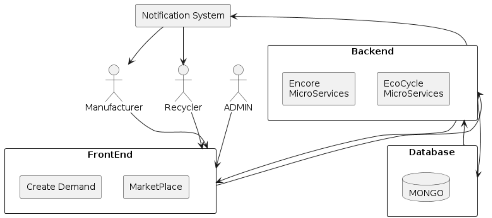

# The C4 model for visualising software architecture

### The C4 model for visualizing software architecture provides a simple and clear way to describe the architecture of a software system. It consists of four different levels of diagrams:

#### 1. Context Diagram: Provides a high-level overview of the system, showing the system as a "black box" and its interactions with external users and other systems.
#### 2. Container Diagram: Zooms into the system, showing the containers (applications, databases, etc.) that make up the system and their interactions.
#### 3. Component Diagram: Breaks down each container to show the components (classes, services, etc.) within it and their relationships.
#### 4. Code (Class) Diagram: Focuses on the details of individual components, typically showing classes and their relationships.

## 1. Context Diagram
The context diagram shows the system as a single box with external entities interacting with it. This includes users (actors) and other systems. The goal is to provide an understanding of who interacts with the system and what those interactions are.

## 2. Container Diagram
The container diagram zooms into the system to show the high-level technical building blocks (containers) such as web applications, databases, and microservices, along with how they communicate.

## 3. Component Diagram
The component diagram delves deeper into the containers to show the components within each container and their relationships. Components might include services, classes, or modules.

## 4. Code (Class) Diagram
The code diagram shows the details of the implementation, often focusing on classes and their relationships for a particular component. This level of detail is typically used by developers.
